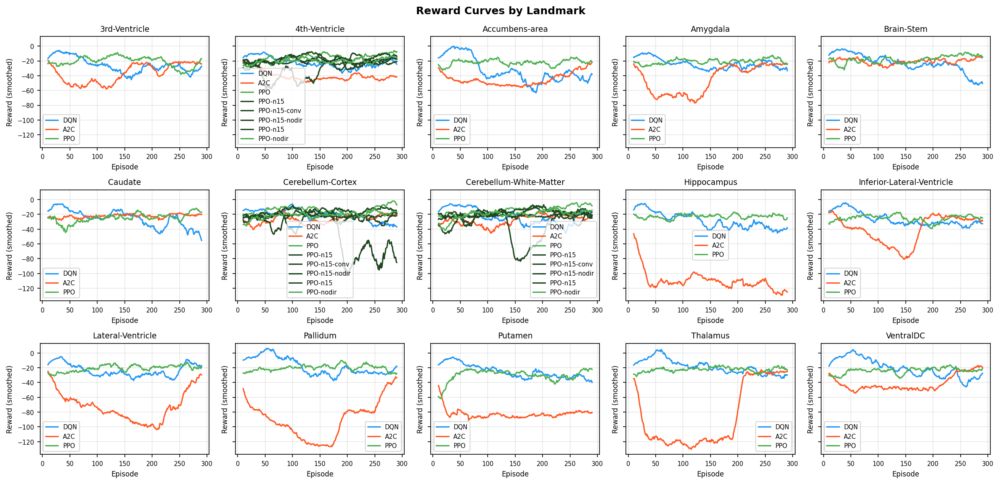
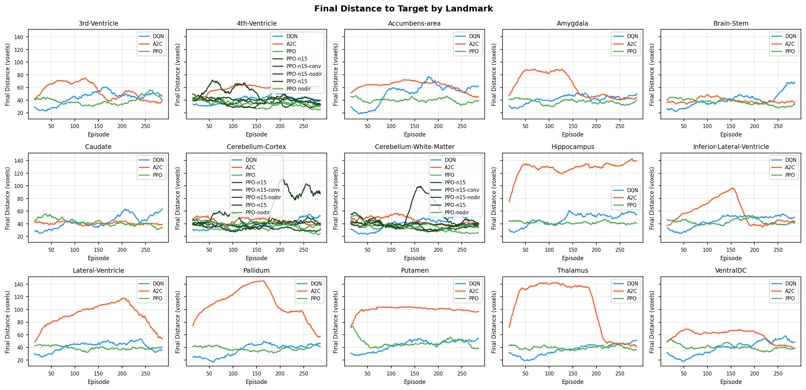
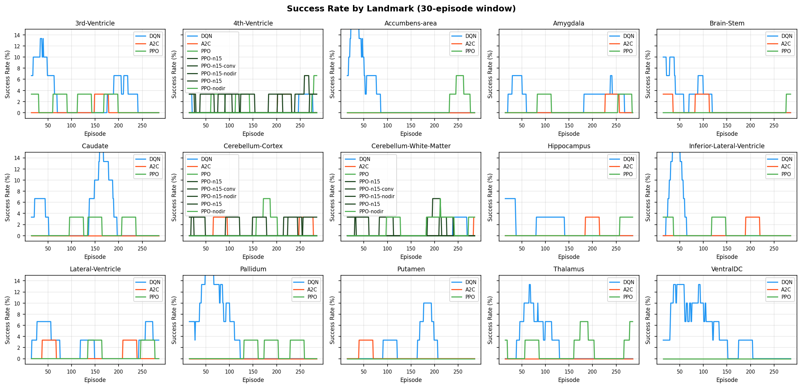

# Deep Reinforcement Learning for Anatomical Landmark Navigation in 3D Brain MRI

**Chris Drake**

**April 6, 2026**

## Introduction

Automated localization of anatomical landmarks in brain MRI is a prerequisite for many neuroimaging pipelines, including atlas registration, surgical planning, and region-of-interest volumetric analysis. Conventional approaches rely on template-based registration (e.g., affine or nonlinear warps to MNI space) or supervised convolutional neural networks trained on densely annotated datasets. Both require substantial manual labeling effort and can generalize poorly to atypical anatomy or pathological brains. This project reframes landmark detection as a sequential navigation problem: a deep RL agent is placed at a random location inside a 3D T1-weighted MNI152 brain volume and must learn a policy to navigate to a specified subcortical target. We target 15 subcortical structures spanning a range of sizes, depths, and tissue contrasts---including the thalamus, hippocampus, lateral ventricles, brain-stem, and putamen.

We have implemented two RL algorithms---DQN and A2C---in a browser-based environment built on TensorFlow.js and Niivue, an open-source WebGL neuroimaging viewer. The agent observes a 7x7x7 voxel neighborhood of normalized intensities around its current position, concatenated with a unit direction vector toward the target (346-dimensional state), and selects among 6 discrete actions (move $\pm$1 voxel along each anatomical axis). Episodes terminate on success (Euclidean distance $\leq$ 3 voxels from the target) or after 200 steps. Initial experiments reveal that DQN learns improved navigation policies on most landmarks when starting from unconstrained random positions, while A2C with a frozen pretrained convolutional backbone from a MeshNet brain parcellation model diverges even when starting within 50 voxels of the target.

## Related Work

Ghesu et al. [1] first formulated anatomical landmark detection as RL navigation in 3D CT volumes using DQN with a fixed-scale patch observation and a frame history buffer to mitigate oscillatory behavior. Alansary et al. [2] extended this to MRI view planning with a multi-scale coarse-to-fine strategy, progressively reducing step sizes across three resolution scales. Both works evaluate only DQN variants (standard DQN, Double DQN, Dueling DQN) and report that no single architecture consistently outperforms across landmarks. Our work differs in three respects: we compare across algorithm families (off-policy value-based DQN vs. on-policy actor-critic A2C and PPO), we replace the frame history buffer with an explicit direction-to-target vector as part of the state representation, and we plan systematic ablations of reward shaping and observation design. Additionally, our system runs entirely in-browser using TensorFlow.js, leveraging pretrained MeshNet [6] convolutional layers from the Brainchop project for subject-specific brain parcellation and as a frozen feature extractor for the A2C architecture.

## Approach

We model the task as an episodic MDP with a discrete action space. At each time step the agent receives a local 7x7x7 neighborhood of min-max normalized voxel intensities (343 values) centered at its current position in the MNI152 volume, concatenated with a 3-component unit direction vector toward the target landmark, yielding a 346-dimensional state vector. The agent selects one of 6 actions corresponding to single-voxel displacements along the three anatomical axes ($\pm$x, $\pm$y, $\pm$z). The reward function combines a dense distance-based shaping signal ($r_\text{dist} = -(d_{t+1} - d_t)$, which is positive when the agent moves closer to the target), a per-step penalty of $-0.1$ to discourage long trajectories, and a terminal success bonus of $+10$ when the agent reaches within 3 voxels of the target. Episodes are capped at 200 steps.

We compare two algorithms. **DQN** uses a feedforward Q-network with three hidden layers (256, 128, 64 units, ReLU activations), an experience replay buffer (capacity 10,000), epsilon-greedy exploration ($\epsilon$: 1.0 $\to$ 0.05, multiplicative decay of 0.995 per episode), and a target network synchronized every 100 gradient steps. DQN receives the full 346-dimensional state vector as a flat input. **A2C** uses a split architecture designed to leverage pretrained neuroimaging features: a frozen convolutional backbone consisting of the first two 3D convolutional layers of a MeshNet brain parcellation model (30 filters each, kernel size 3x3x3, dilation rates 1 and 2) extracts a 10,290-dimensional feature vector from the 7x7x7 neighborhood. These features are compressed through trainable dense layers (128 $\to$ 64) and concatenated with the direction vector to produce both a policy (softmax over 6 actions) and a scalar value estimate. A2C is trained with generalized advantage estimation (GAE, $\lambda = 0.95$), entropy regularization (coefficient 0.01), and Adam (lr = 0.0003). All three algorithms in our main comparison use a 50-voxel starting radius to keep conditions directly comparable. **PPO** uses the same 346-dimensional flat state and two dense hidden layers (128, 64) shared between policy and value heads, a clipped surrogate objective (clip $\epsilon$ = 0.2), GAE ($\lambda = 0.95$), 4 epochs per batch with a batch size of 64 trajectories, and Adam (lr = 0.0003). The A2C results reported below use the flat variant (no frozen backbone) described above, since the MeshNet-backbone version diverged uniformly in our prior report.

## Experimental Results

We ran a full three-algorithm sweep across all 15 subcortical landmarks (DQN, A2C, and PPO $\times$ 15 targets, 300 episodes each, 50-voxel starting radius, identical reward function, state representation, and episode length cap). The A2C variant evaluated here is the flat architecture (346-dim input, fully trainable dense layers) that bypasses the frozen MeshNet backbone responsible for the divergence observed in our previous report. Performance was summarized using the mean over the first 50 episodes (early) and last 50 episodes (late).

**Aggregate results.** Averaged over 15 landmarks, PPO achieved the best late reward (-18.7), lowest final distance (36.5 voxels), and highest late-window success rate (1.2%). Flat A2C improved modestly over training (-43.2 $\to$ -37.6) but remained worse than PPO on nearly every landmark. DQN, surprisingly, *regressed* over training on the average landmark (-10.7 $\to$ -32.6 reward; final distance 50.1 voxels), although individual episodes early in training occasionally achieved success. This pattern---early exploratory successes followed by late-stage reward collapse---is consistent with Q-value overestimation and catastrophic forgetting once $\epsilon$ has decayed and the replay buffer is dominated by the agent's own recent (drifting) trajectories.

**PPO** was the strongest algorithm on 11/15 landmarks by late reward and 13/15 by mean final distance. It was the only algorithm to reach non-zero late-window success rates on a majority of landmarks (9/15). PPO's clipped surrogate objective and on-policy updates appear well suited to this navigation task, where small policy changes per update preserve the directional signal in the dense distance-shaped reward. The easiest landmarks for PPO were the cerebellar structures (Cerebellum-White-Matter: late reward -7.1; Cerebellum-Cortex: -7.5) and the 4th Ventricle (-8.9), all of which occupy spatially distinctive regions with clear tissue boundaries. The hardest were the 3rd Ventricle (-27.8), Pallidum (-23.3), and Putamen (-26.4)---small, medially located gray/CSF structures where the 7x7x7 neighborhood captures less unique anatomical context.

**A2C** (flat variant) learned to navigate but under-performed PPO on every landmark except VentralDC (where the two tied). It diverged on two landmarks: Hippocampus (late reward -123, final distance 138 voxels) and Putamen (-80, 97 voxels)---both small/curved structures whose gradients appear harder to estimate with high-variance single-sample advantage updates. This confirms that while the flat architecture recovers the stability we lost with the frozen MeshNet backbone, pure A2C without PPO's trust-region clipping is still fragile on this task.

**DQN** outperformed PPO on only one landmark (Lateral-Ventricle, late reward -15.6 vs PPO -18.5), reached the highest single-landmark late-window success rate observed (4% on Lateral-Ventricle), but was otherwise dominated by both on-policy methods. Across landmarks, DQN's early reward was actually the best of the three algorithms (-10.7)---indicating that random exploration under high $\epsilon$ plus the distance-shaped reward produces reasonable initial trajectories---but the policy deteriorated as $\epsilon$ decayed and the Q-network was trained on its own stale replay buffer.

*Figure 1: Smoothed mean episode reward over 300 training episodes for each algorithm on each of the 15 subcortical landmarks. PPO (green) improves or remains stable on all landmarks; A2C (orange) improves modestly but diverges on Hippocampus and Putamen; DQN (blue) regresses on most landmarks after initial high-$\epsilon$ exploration.*

*Figure 2: Smoothed mean final Euclidean distance to target (voxels). PPO achieves the lowest final distances on 13/15 landmarks; starting radius was 50 voxels for all configurations.*

*Figure 3: Success rate (fraction of episodes reaching within 3 voxels of the target, 30-episode rolling window). Success rates remain in the low single digits across all algorithms at 300 episodes, but PPO is the only algorithm with non-zero late-window success on a majority of landmarks.*

*Table 1: Late-window (last 50 episodes) performance metrics per (algorithm, landmark) pair. All configurations used a 50-voxel starting radius and 200-step episode cap.*

| Landmark                   | DQN R  | A2C R   | PPO R  | DQN d | A2C d | PPO d | DQN % | A2C % | PPO % |
|----------------------------|-------:|--------:|-------:|------:|------:|------:|------:|------:|------:|
| 3rd-Ventricle              | -32.0  |  -23.3  | -27.8  |  47.8 |  37.8 |  45.9 |   0%  |   0%  |   0%  |
| 4th-Ventricle              | -22.7  |  -43.3  |  -8.9  |  41.6 |  62.4 |  25.8 |   2%  |   0%  |   4%  |
| Accumbens-area             | -40.6  |  -27.9  | -20.0  |  59.1 |  46.7 |  37.4 |   0%  |   0%  |   2%  |
| Amygdala                   | -27.4  |  -24.8  | -19.2  |  46.8 |  43.1 |  36.8 |   2%  |   0%  |   2%  |
| Brain-Stem                 | -46.2  |  -16.2  | -12.1  |  63.9 |  35.8 |  31.1 |   0%  |   0%  |   2%  |
| Caudate                    | -45.1  |  -20.1  | -18.3  |  59.3 |  39.0 |  35.2 |   0%  |   0%  |   0%  |
| Cerebellum-Cortex          | -35.5  |  -20.2  |  -7.5  |  52.7 |  37.9 |  26.2 |   0%  |   2%  |   0%  |
| Cerebellum-White-Matter    | -21.3  |  -23.5  |  -7.1  |  41.5 |  40.5 |  25.7 |   2%  |   2%  |   0%  |
| Hippocampus                | -40.3  | -123.0  | -23.2  |  55.5 | 138.0 |  41.2 |   0%  |   0%  |   2%  |
| Inferior-Lateral-Ventricle | -34.2  |  -27.0  | -22.8  |  51.6 |  44.0 |  39.6 |   0%  |   0%  |   0%  |
| Lateral-Ventricle          | -15.6  |  -40.7  | -18.5  |  35.3 |  60.7 |  38.7 |   4%  |   0%  |   2%  |
| Pallidum                   | -24.7  |  -46.4  | -23.3  |  41.6 |  65.0 |  43.0 |   0%  |   0%  |   0%  |
| Putamen                    | -36.3  |  -80.2  | -26.4  |  53.7 |  97.1 |  42.3 |   0%  |   0%  |   0%  |
| Thalamus                   | -29.7  |  -25.8  | -22.3  |  46.8 |  44.0 |  38.8 |   0%  |   0%  |   4%  |
| VentralDC                  | -36.8  |  -21.0  | -23.9  |  53.4 |  41.3 |  39.4 |   0%  |   0%  |   0%  |
| **Mean (15 landmarks)**    | **-32.6** | **-37.6** | **-18.7** | **50.1** | **55.5** | **36.5** | **0.7%** | **0.3%** | **1.2%** |

R = late-window mean reward; d = late-window mean final distance (voxels); % = late-window success rate.

### Neighborhood-size ablation (PPO, 7³ vs 15³)

As a first ablation motivated by Ghesu et al.'s 25³ receptive field, we re-ran PPO on the three easiest landmarks (Cerebellum-White-Matter, Cerebellum-Cortex, 4th-Ventricle) with the observation cube enlarged from 7³ (346-dim state) to 15³ (3,378-dim state). The flat architecture, learning rate ($3 \times 10^{-4}$), entropy coefficient (0.01), and 300-episode budget were held constant.

*Table 2: PPO with 7³ vs 15³ observation window on the three easiest landmarks (last 50 episodes).*

| Landmark                 | Late R (7³) | Late R (15³) | $\Delta$R | Late dist (7³) | Late dist (15³) | $\Delta$dist |
|--------------------------|------------:|-------------:|----------:|---------------:|----------------:|-------------:|
| Cerebellum-White-Matter  | $-7.1$      | $-20.7$      | $-13.7$   | 25.8           | 40.6            | $+14.9$      |
| Cerebellum-Cortex        | $-7.5$      | $-79.3$      | $-71.8$   | 26.2           | 96.3            | $+70.1$      |
| 4th-Ventricle            | $-8.9$      | $-18.1$      | $-9.2$    | 25.8           | 34.8            | $+9.0$       |

Across all three landmarks, enlarging the receptive field **hurt** performance under fixed hyperparameters. The first dense layer grew from $\sim$89K parameters (at 7³) to $\sim$865K (at 15³). Cerebellum-Cortex initially diverged to late reward $-79$ on one seed, but a second seed at the same configuration ran to $-14.7$, so the 15³-flat regression is noisy across seeds rather than systematically catastrophic. To separate receptive field from architecture-capacity, we then ran PPO at 15³ with a small trainable 3D conv trunk (two 3³ conv layers with 16 filters each, ReLU, max-pool 2, followed by the same 128/64 dense heads and direction concatenation).

*Table 3: PPO at 15³ with flat MLP vs trainable 3D conv trunk, compared against the 7³ baseline (last 50 episodes, two independent seeds for the flat variant).*

| Landmark                 | PPO 7³ flat | PPO 15³ flat (seed 1) | PPO 15³ flat (seed 2) | PPO 15³ conv |
|--------------------------|------------:|----------------------:|----------------------:|-------------:|
| Cerebellum-White-Matter  | $-7.1$      | $-20.7$               | $-23.9$               | $-22.0$      |
| Cerebellum-Cortex        | $-7.5$      | $-79.3$               | $-14.7$               | $-22.0$      |
| 4th-Ventricle            | $-8.9$      | $-18.1$               | $-16.9$               | $-22.4$      |

The trainable conv trunk lands inside the flat-seed noise band on all three landmarks and does not close the gap to the 7³ baseline. In other words, giving the larger receptive field an appropriate inductive bias does not rescue it. A plausible explanation is that the explicit unit-direction-to-target vector already encodes the coarse navigation signal the agent needs; enlarging the voxel window then contributes little task-relevant information while requiring more training to fit. The direct test is a **direction-vector ablation**: re-run PPO at 7³ and 15³ (both flat and conv) with the three-component direction input zeroed out. If 7³ performance collapses, direction is doing the work; if 7³ is robust but 15³ suddenly benefits, the larger receptive field is bringing in useful voxel context that the direction shortcut was masking. Either outcome pins down where the remaining performance headroom actually lives.

Two follow-up observations motivate the remaining work. First, absolute success rates are still low (single digits) even for the best algorithm, confirming that 300 episodes is short of what the task requires; a 1000--3000 episode run with PPO on the three easiest landmarks will establish whether PPO plateaus at a usable success rate or continues climbing. Second, the DQN regression pattern suggests the target-network sync interval (100 steps) and replay buffer size (10,000) are under-tuned for navigation-length episodes; we plan a short DQN hyperparameter sweep rather than discarding the algorithm.

## Future Milestones

- **April 14 (in progress):** Introduce configurable observation neighborhood size (5³ through 25³), keyed through the experiment config and serialized into every result record so that runs at different scales can be appended to the same results corpus. This enables a direct receptive-field ablation motivated by Ghesu et al., who use a 25³ ROI rather than our current 7³.
- **April 17:** Neighborhood-size ablation on the three easiest PPO landmarks (Cerebellum-White-Matter, Cerebellum-Cortex, 4th-Ventricle). Sizes 7³ (baseline), 11³, 15³, 19³. For 19³+ flat-dense becomes wasteful, so add a small task-trained 3D conv trunk (two $3^3$ conv layers, 16 filters, no frozen weights).
- **April 19:** Remaining ablations---reward formulation (sparse vs. dense vs. hybrid), with/without direction vector, starting distance curriculum (25 → 50 → 100 voxels)---run only once neighborhood-size and training-length ablations have identified a configuration with non-trivial success rates.
- **April 21:** Longer-training PPO run (1000--3000 episodes) on the best neighborhood size to establish a success-rate ceiling; DQN hyperparameter sweep (replay buffer size, target-sync interval).
- **April 22:** Rank landmarks by difficulty and correlate with anatomical properties (structure volume, tissue contrast); prepare final report and presentation.
- **April 22--27:** Project presentations.

## Conclusion

We have built a browser-based platform for investigating deep RL-based anatomical landmark navigation in 3D brain MRI, combining TensorFlow.js for model training with Niivue for real-time neuroimaging visualization. A full three-algorithm comparison across all 15 subcortical landmarks ranks PPO first on 11/15 landmarks by late reward and 13/15 by final distance, with flat A2C a clear second and DQN third. PPO is the only algorithm that reaches non-zero late-window success rates on a majority of landmarks; A2C remains fragile on small structures (Hippocampus, Putamen); and DQN exhibits a regression pattern suggestive of Q-value instability as $\epsilon$ decays. The remaining work focuses on extending PPO training to 1000--3000 episodes to establish a usable success-rate ceiling, a short DQN hyperparameter sweep (replay size, target-sync interval), and ablations of reward shaping, observation size, and the direction-vector component of the state.

## References

[1] F. C. Ghesu et al., "Multi-scale deep reinforcement learning for real-time 3D-landmark detection in CT scans," *IEEE Trans. Pattern Anal. Mach. Intell.*, vol. 41, no. 1, pp. 176--189, 2019.

[2] A. Alansary et al., "Automatic view planning with multi-scale deep reinforcement learning agents," in *Proc. MICCAI*, 2018.

[3] J. Schulman et al., "Proximal policy optimization algorithms," *arXiv:1707.06347*, 2017.

[4] V. Mnih et al., "Human-level control through deep reinforcement learning," *Nature*, vol. 518, pp. 529--533, 2015.

[5] V. Mnih et al., "Asynchronous methods for deep reinforcement learning," in *Proc. ICML*, 2016.

[6] S. M. Plis, M. Masoud, and F. Hu, "Brainchop: Providing an edge ecosystem for deployment of neuroimaging artificial intelligence models," *Aperture Neuro*, vol. 4, 2024.
