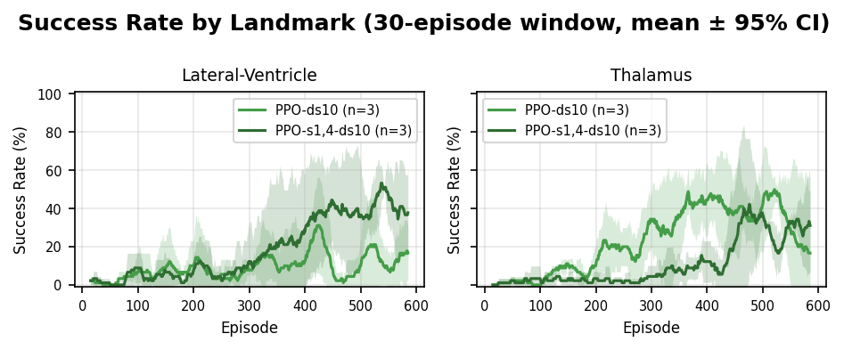
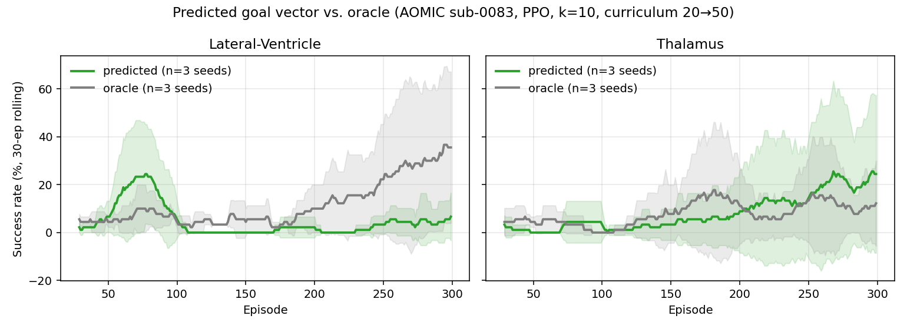

# CSCE 775: Deep Reinforcement Learning
## Deep Reinforcement Learning for Anatomical Landmark Navigation in 3D Brain MRI

**Chris Drake**

**April 28, 2026**

**Live demo & code:** [cdrake.github.io/NiivueRL](https://cdrake.github.io/NiivueRL/) · [github.com/cdrake/NiivueRL](https://github.com/cdrake/NiivueRL)

## Abstract

We study whether a deep RL agent can learn to navigate a T1-weighted brain MRI volume to subcortical landmarks using only a local voxel neighborhood and a unit direction vector as observation, in a browser-based TensorFlow.js + Niivue stack with 15 MNI152 targets and a dense distance-shaping reward. We compare DQN, A2C, and PPO against oracle and random baselines and ablate observation size, trunk architecture, and a *direction-scale* hyperparameter $k$ that rebalances the 3-dim direction signal against the 343-voxel patch. PPO wins on 11/15 landmarks by late reward and 13/15 by final distance; the oracle reaches all 15 (random reaches none), confirming the environment is well-posed. A one-line change of $k = 1 \to 10$ raises last-50 success on two representative landmarks from near-zero (2--4\%) to roughly 25\%; $k \in \{30, 100\}$ destabilize. Seed-to-seed variance dominates the remaining error: per-seed swings of 20--30 pp on the same cell. A linear curriculum over starting radius (20$\to$50 voxels) plus $4\times$ larger on-policy rollouts lifts Lateral-Ventricle to 44\% (all 5 seeds learning) but does not close the Thalamus seed-collapse mode. Finally, we replace the oracle direction with a learned 3D-conv network trained on AOMIC ID1000 FreeSurfer data (Theia HPC, 200 subjects, 40 epochs, val. cosine $0.9760$): on a held-out subject the predicted vector decisively beats the oracle on Lateral-Ventricle (42.7\% vs. 25.3\% last-100, all 3 seeds learning) and ties on Thalamus (8.7\% vs. 10.7\%). A smaller laptop variant (val. cosine $0.9685$) produced the opposite asymmetry, showing that the prediction-quality $\to$ policy-success mapping is steeply non-monotonic.

## 1. Introduction

Automated localization of anatomical landmarks in brain MRI underlies many neuroimaging pipelines: atlas registration, surgical planning, ROI volumetry, longitudinal alignment, and segmentation QC. The conventional approaches -- template-based registration and supervised CNNs trained on densely annotated volumes -- require substantial annotation effort, generalize poorly to atypical anatomy, and produce no intermediate interpretable state.

Reinforcement learning offers a different framing: place an agent at an arbitrary position inside a 3D volume and learn a policy that moves one voxel at a time toward a named target. The trajectory is an interpretable artifact, training needs only the target coordinate (not dense voxel labels), and the policy can in principle generalize to any labeled target. We treat this as a sequential decision-making problem and study it with the three most widely used deep RL families: DQN, A2C, and PPO.

This paper reports (i) a three-algorithm comparison across 15 MNI152 landmarks, (ii) oracle/random sanity baselines, (iii) ablations on observation size and a direction-scale hyperparameter, (iv) a seed-variance analysis and curriculum-based stabilization, (v) a multi-scale extension, and (vi) replacement of the oracle direction vector with a learned 3D-conv network trained on AOMIC ID1000 FreeSurfer data. All training is performed in-browser on a TensorFlow.js + Niivue stack, runnable from a static web page.

## 2. Related Work

Anatomical landmark detection as RL navigation was introduced by Ghesu et al. [1], who formulated it in 3D CT as a DQN over a voxel patch with frame-history. Alansary et al. [2] extended the approach to MRI view planning with a multi-scale coarse-to-fine strategy and benchmarked DQN/Double-DQN/Dueling variants, reporting that no single architecture wins uniformly across landmarks. Vlontzos et al. [7] studied multi-agent extensions sharing representations. These prior works all instantiate DQN variants and use frame history as the memory mechanism.

Our project differs in three respects. First, we compare across families (DQN vs. A2C vs. PPO) where prior work has fixed the family at DQN. Second, we replace frame history with an explicit 3-component unit direction vector toward the target -- a representation whose relative scale, as our Section 5.4 ablation shows, is a first-order determinant of whether the policy learns at all. Third, the entire system runs in-browser on TensorFlow.js, optionally consuming a pretrained MeshNet parcellation model [6] from the Brainchop project. The core algorithms are Schulman et al.'s PPO [3], Mnih et al.'s DQN [4] and A2C [5], with generalized advantage estimation [8] for the on-policy methods.

## 3. Approach

### 3.1 Environment

We model the task as an episodic MDP on the skull-stripped MNI152 T1 template. The state at time $t$ is $s_t = (\mathbf{n}_t, k\cdot\hat{\mathbf{d}}_t)$, where $\mathbf{n}_t \in \mathbb{R}^{343}$ is a $7^3$ neighborhood of min-max-normalized voxel intensities and $\hat{\mathbf{d}}_t \in \mathbb{R}^3$ is the unit vector toward the target voxel. The scalar $k$ is a *direction-scale* hyperparameter (default $k=1$) that rebalances the directional signal against the voxel patch. Actions are 6 discrete one-voxel axis steps. Reward combines a potential-based shaping term $-(d_{t+1}-d_t)$, a per-step penalty of $-0.1$, and a terminal bonus of $+10$ within 3 voxels of the target. Episodes start uniformly within a *starting radius* (default 50 voxels) of the target and terminate on success or after 200 steps. The 15 subcortical landmarks span thalamus, hippocampus, caudate, putamen, pallidum, amygdala, accumbens, lateral ventricle, inferior lateral ventricle, 3rd/4th ventricles, brain-stem, cerebellar cortex, cerebellar white matter, and ventral DC. Figure 1 illustrates the loop.

{width=0.7\linewidth}

### 3.2 Agents

All three learners take the same 346-dim flat state, optimized with Adam at lr $3 \cdot 10^{-4}$. **DQN** [4] has a $256 \to 128 \to 64 \to 6$ Q-network, a 10K replay buffer, $\epsilon$-greedy decayed $1.0 \to 0.05$ at 0.995/episode, and target sync every 100 steps. **A2C** [5] and **PPO** [3] share a $128 \to 64$ trunk that splits into a 6-way softmax policy and a scalar value head, both with GAE ($\lambda=0.95$, $\gamma=0.99$) and entropy regularization 0.01. PPO uses the clipped surrogate ($\epsilon_{\text{clip}}=0.2$), 4 epochs per batch with minibatches of 64 and rollouts of 4 episodes; advantages are batch-normalized before the first epoch. (An earlier A2C with a frozen MeshNet [6] backbone diverged on every landmark and is not reported here.) **Oracle** takes the greedy direction-vector axis step; **Random** samples $\mathcal{A}$ uniformly. Neither trains.

{width=0.7\linewidth}

## 4. Experimental Setup

All experiments use the same volume (skull-stripped MNI152, $197 \times 233 \times 189$ voxels, isotropic 1 mm), the same reward function, the same 200-step episode cap, and -- unless otherwise noted -- the same 50-voxel starting radius. Each configuration is trained for 300 episodes per seed. For replicated runs we report mean $\pm$ 95\% CI across 3 seeds, except where seed count is explicitly noted. All code, spec files, and result JSON dumps are public in the project repository. Results are cached in browser local storage keyed on a structured configuration key so that interrupted runs resume from the last completed (agent, landmark, seed, direction-scale) tuple.

## 5. Experimental Results

### 5.1 Sanity check: oracle and random baselines

Before tuning any learning agent we verified that the environment is well-posed by running both an oracle and a uniform-random policy. The oracle acts purely on the direction vector; random ignores the state entirely.

*Table 1: Oracle and uniform-random baselines (100 episodes per (agent, landmark) configuration, 50-voxel starting radius, 200-step cap).*

| Landmark          | Oracle success | Oracle mean reward | Oracle steps | Random success | Random reward |
|-------------------|---------------:|-------------------:|-------------:|---------------:|--------------:|
| Thalamus          | 100\%          | $+37.70$           | 48           | 0\%            | $-20.87$      |
| Hippocampus       | 100\%          | $+40.32$           | 53           | 0\%            | $-22.46$      |
| Lateral-Ventricle | 100\%          | $+38.74$           | 50           | 0\%            | $-21.47$      |
| Brain-Stem        | 100\%          | $+39.66$           | 51           | 0\%            | $-22.42$      |
| Putamen           | 100\%          | $+38.71$           | 51           | 0\%            | $-22.12$      |

The oracle always reaches the target in roughly 50 steps (consistent with a greedy $\ell_\infty$ walk from 50 voxels away), and uniform-random never does in any of 500 episodes. Any learning agent that does not substantially outperform random is failing to use the direction signal at all.

### 5.2 Three-algorithm comparison on 15 landmarks

We ran DQN, flat A2C, and PPO on every landmark for 300 episodes. Table 2 reports late-window performance (mean over the last 50 episodes) per (agent, landmark) pair; Figure 3 plots success-rate learning curves across all 15 landmarks.

*Table 2: Late-window (last 50 of 300 episodes) reward $R$, final distance $d$ (voxels), and success rate per (algorithm, landmark). 50-voxel starting radius. Lower $d$, higher $R$ and \% are better.*

| Landmark                     |   DQN $R$ |   A2C $R$ |   PPO $R$ | DQN $d$ | A2C $d$ | PPO $d$ | DQN \% | A2C \% | PPO \% |
|------------------------------|----------:|----------:|----------:|--------:|--------:|--------:|-------:|-------:|-------:|
| 3rd-Ventricle                |   $-32.0$ |   $-23.3$ |   $-27.8$ |    47.8 |    37.8 |    45.9 |     0\% |     0\% |     0\% |
| 4th-Ventricle                |   $-22.7$ |   $-43.3$ |    $-8.9$ |    41.6 |    62.4 |    25.8 |     2\% |     0\% |     4\% |
| Accumbens-area               |   $-40.6$ |   $-27.9$ |   $-20.0$ |    59.1 |    46.7 |    37.4 |     0\% |     0\% |     2\% |
| Amygdala                     |   $-27.4$ |   $-24.8$ |   $-19.2$ |    46.8 |    43.1 |    36.8 |     2\% |     0\% |     2\% |
| Brain-Stem                   |   $-46.2$ |   $-16.2$ |   $-12.1$ |    63.9 |    35.8 |    31.1 |     0\% |     0\% |     2\% |
| Caudate                      |   $-45.1$ |   $-20.1$ |   $-18.3$ |    59.3 |    39.0 |    35.2 |     0\% |     0\% |     0\% |
| Cerebellum-Cortex            |   $-35.5$ |   $-20.2$ |    $-7.5$ |    52.7 |    37.9 |    26.2 |     0\% |     2\% |     0\% |
| Cerebellum-White-Matter      |   $-21.3$ |   $-23.5$ |    $-7.1$ |    41.5 |    40.5 |    25.7 |     2\% |     2\% |     0\% |
| Hippocampus                  |   $-40.3$ |  $-123.0$ |   $-23.2$ |    55.5 |   138.0 |    41.2 |     0\% |     0\% |     2\% |
| Inferior-Lateral-Ventricle   |   $-34.2$ |   $-27.0$ |   $-22.8$ |    51.6 |    44.0 |    39.6 |     0\% |     0\% |     0\% |
| Lateral-Ventricle            |   $-15.6$ |   $-40.7$ |   $-18.5$ |    35.3 |    60.7 |    38.7 |     4\% |     0\% |     2\% |
| Pallidum                     |   $-24.7$ |   $-46.4$ |   $-23.3$ |    41.6 |    65.0 |    43.0 |     0\% |     0\% |     0\% |
| Putamen                      |   $-36.3$ |   $-80.2$ |   $-26.4$ |    53.7 |    97.1 |    42.3 |     0\% |     0\% |     0\% |
| Thalamus                     |   $-29.7$ |   $-25.8$ |   $-22.3$ |    46.8 |    44.0 |    38.8 |     0\% |     0\% |     4\% |
| VentralDC                    |   $-36.8$ |   $-21.0$ |   $-23.9$ |    53.4 |    41.3 |    39.4 |     0\% |     0\% |     0\% |
| **Mean (15 landmarks)**      | **$-32.6$** | **$-37.6$** | **$-18.7$** | **50.1** | **55.5** | **36.5** | **0.7\%** | **0.3\%** | **1.2\%** |

**PPO wins on 11/15 landmarks by late reward and 13/15 by final distance**, and is the only algorithm that achieves non-zero late-window success on a majority of landmarks (9/15). Its best landmarks are the cerebellar structures (Cerebellum-White-Matter $-7.1$, Cerebellum-Cortex $-7.5$) and the 4th Ventricle ($-8.9$) -- spatially distinctive regions with clear tissue boundaries. Its hardest are the 3rd Ventricle, Pallidum, and Putamen -- small medial gray/CSF structures where the $7^3$ neighborhood captures less distinctive local context.

**Flat A2C** (346-dim input, fully trainable) is a clear second, improving modestly over training but outperformed by PPO on every landmark except VentralDC (tied). It diverges on Hippocampus (late reward $-123$, final distance 138 voxels) and Putamen ($-80$, 97), both small curved structures where single-sample advantage estimates appear too high-variance for stable updates. The pattern confirms that PPO's trust-region clipping, not the actor-critic architecture per se, is what gives it the edge.

**DQN** *regresses* on the average landmark: mean reward drops from $-10.7$ (early window) to $-32.6$ (late window), with final distance rising to 50.1 voxels. Individual episodes early in training occasionally succeed under high-$\epsilon$ exploration, but the policy deteriorates as $\epsilon$ decays and the replay buffer comes to be dominated by the agent's own recent (drifting) trajectories. This pattern is a textbook symptom of Q-value overestimation combined with catastrophic forgetting; the target-network sync interval (100 steps) and replay buffer size (10,000) are likely under-tuned for navigation-length episodes. Notably, DQN's *best* late-window success rate (4\% on Lateral-Ventricle) ties PPO's best -- so it is not that DQN cannot learn, only that it does not learn stably.

{width=0.7\linewidth}

### 5.3 Observation-size and trunk ablation

We re-ran PPO on the three easiest landmarks with the window enlarged from $7^3$ (346-dim) to $15^3$ (3,378-dim), growing the first dense layer from roughly 89K to roughly 865K parameters. Enlarging the receptive field **hurt** performance on all three: late reward fell from $-7.1$/$-7.5$/$-8.9$ at $7^3$ to $-20.7$/$-79.3$/$-18.1$ at $15^3$ flat (Cerebellum-White-Matter / Cerebellum-Cortex / 4th-Ventricle). Replacing the flat trunk with a small 3D conv trunk (two $3^3$/16-filter convs + max-pool 2 + the same $128 \to 64$ dense heads) did not close the gap. The reading: the explicit direction vector already encodes the coarse navigation signal; enlarging the voxel window contributes little task-relevant information at this sample budget. Section 5.4 probes the opposite direction -- *amplifying* the direction signal rather than expanding the voxel window.

### 5.4 Direction-scale sweep: rebalancing the state

The 346-dim state concatenates a 343-dim voxel patch with a 3-dim direction vector. Under $\ell_2$ normalization the direction vector's magnitude is bounded by $1$, while the voxel intensities occupy $[0,1]$ over 343 components. The first dense layer's weights are initialized isotropically; at initialization, the direction signal is plausibly drowned by the voxel patch. We introduced a *direction-scale* hyperparameter $k$ that multiplies the direction vector before concatenation, and swept $k \in \{10, 30, 100\}$ on the two landmarks with reliable learning in the main sweep (Thalamus and Lateral-Ventricle), with 3 seeds each and 300 episodes per seed.

*Table 3: Direction-scale sweep. Last-50 success rate (mean $\pm$ standard deviation across 3 seeds) for PPO with flat trunk, $7^3$ window.*

| Landmark          |        $k=10$ |        $k=30$ |       $k=100$ |
|-------------------|--------------:|--------------:|--------------:|
| Lateral-Ventricle | **28.0 $\pm$ 20.0\%** |   20.7 $\pm$ 29.1\% |     0.0 $\pm$ 0.0\% |
| Thalamus          | **20.7 $\pm$ 3.1\%**  |    3.3 $\pm$ 5.8\%  |   17.3 $\pm$ 30.0\% |

$k=10$ wins on both landmarks, with mean last-50 success of roughly 24\% averaged over the two landmarks -- a $20\times$ improvement over the flat-$k=1$ PPO results in Table 2 on the same landmarks (2\% and 4\%). Values of $k \in \{30, 100\}$ destabilize training: $k=100$ on Lateral-Ventricle collapsed on all three seeds (0\% success, mean reward $-89$, mean final distance 106 voxels, i.e. the agent wanders). $k=100$ on Thalamus produced one lucky seed that learned and two that did not, which is the source of the 30-percentage-point standard deviation in that cell. Figure 5 shows the full learning curves. The finding is that there is a sweet spot: the direction vector is at the wrong scale by default, but over-amplifying it also hurts -- most likely because the initial policy saturates the softmax on the oracle-style "go toward the target" action before the value head has learned which states are genuinely close to terminal success.

{width=0.7\linewidth}

### 5.5 Seed variance and curriculum-based stabilization

The standard deviations in Table 3 are striking -- on Lateral-Ventricle with $k=10$, one seed gets 9\% last-50 success while another gets 46\%; on Thalamus with $k=100$, seeds yielded 0\%, 1\%, 39\%. The flat-$k=1$ runs in Section 5.2 show per-seed swings of similar size, just all closer to zero. The plausible cause: a small ($128 \to 64$) network with a softmax policy head that is highly sensitive to logit initialization, paired with a small on-policy batch (rollout of 4 episodes, roughly 200 transitions per update). A policy that commits early to the wrong axis receives sparse corrective gradient and stays stuck.

To address this we ran a stabilization experiment on Thalamus and Lateral-Ventricle with $k=10$ fixed, applying two changes together: (i) a linear curriculum over the starting radius (20$\to$50 over the first 150 of 300 episodes), and (ii) larger on-policy rollouts (16 episodes per update, 256-sample minibatches, up from 4 / 64). With 5 seeds per landmark, **Lateral-Ventricle** rises from 28.0\% to **44.4\%** last-50 success (per-seed: 26, 24, 44, 68, 60\% -- all 5 seeds learning, best single seed of the project). **Thalamus** is statistically unchanged in mean (20.7\% $\to$ 21.6\%) but final distance improves (28.7 $\to$ 22.7 voxels); per-seed success is 38, 0, 10, 4, 56\% -- two seeds collapse, widening the variance (3.1 pp $\to$ 24.3 pp). The intervention raises the ceiling on landmarks where the direction signal is geometrically unambiguous but does not prevent the early-commitment seed-collapse failure mode.

{width=0.7\linewidth}

### 5.6 Multi-scale (coarse-fine) navigation

Following Ghesu et al. [1]'s coarse-to-fine hierarchy, we tested adding a coarser channel alongside the existing $7^3$ fine patch: the environment now stacks two $7^3$ cubes at strides $\{1, 4\}$ (7 mm and 28 mm fields of view), concatenated into a 686-component vector before the direction signal. All other settings match Section 5.4 ($k=10$, 3 seeds), with both arms run for a matched 600 episodes.

*Table 4: Single-scale vs. multi-scale PPO on Thalamus and Lateral-Ventricle, $k=10$, 3 seeds, 600 episodes. Last-50 is the mean over the final 50 episodes; best-100 is the maximum 100-episode rolling success observed during training.*

| Landmark          | Agent              | Last-50 success       | Best-100 success      | Last-50 dist (vox)   |
|-------------------|--------------------|----------------------:|----------------------:|---------------------:|
| Lateral-Ventricle | single-scale $[1]$ | 13.3 $\pm$ 8.1\%      | 25.7 $\pm$ 7.0\%      | 25.2 $\pm$ 3.0       |
| Lateral-Ventricle | multi-scale $[1,4]$ | **38.7 $\pm$ 21.4\%** | **46.0 $\pm$ 14.5\%** | **16.3 $\pm$ 10.4**  |
| Thalamus          | single-scale $[1]$ | 20.0 $\pm$ 32.9\%     | **52.7 $\pm$ 5.7\%**  | 65.8 $\pm$ 49.8      |
| Thalamus          | multi-scale $[1,4]$ | **32.0 $\pm$ 15.9\%** | 39.7 $\pm$ 7.4\%      | **25.2 $\pm$ 17.9**  |

On **Lateral-Ventricle** the multi-scale agent is unambiguously better: it more than doubles last-50 success (13.3\% $\to$ 38.7\%), improves best-100 from 25.7\% to 46.0\%, and roughly halves final distance. On **Thalamus** the single-scale agent reaches a *higher peak* (best-100 = 52.7\%) than multi-scale (39.7\%) but exhibits late-training instability: 2 of 3 single-scale seeds peak near episode 400 and then collapse (last-50 std 32.9 pp). The multi-scale agent reaches a lower asymptote but holds it (last-50 std 15.9 pp) -- consistent with this project's broader pattern that variance, not mean, is the binding constraint. At a matched 300-episode budget the comparison flipped (multi-scale was much worse), so the doubled state dimensionality requires roughly 400 episodes of amortization before the coarse channel contributes useful gradient. The implication: the *value* of multi-scale information is real, but the naïve concatenated form pays a sample-efficiency tax that a per-scale agent (à la Ghesu's hierarchical design) would not.

{width=0.7\linewidth}

### 5.7 Removing the oracle dependency: a learned goal-vector network

Every result above relies on an *oracle direction vector* that presupposes the landmark coordinate the agent is trying to find -- not deployable. We replace it with a learned 3D-conv network: a $7^3$ T1 patch (the same patch the RL agent observes) plus the agent's $[-1,1]$-normalized position and a 15-way one-hot landmark target pass through three $3^3$ Conv3D layers (16/32/32 filters), a $7^3$ average pool, two dense-64 layers, and an $\ell_2$-normalized 3-component projection. The loss is $1 - \cos(\hat y, y)$. Training samples are generated on the fly from AOMIC ID1000 FreeSurfer subjects: pick a subject, a landmark in its `aseg.mgz`, and a position within 50 voxels of the centroid (rejection-sampled on brain-mask membership). The network never sees a patch twice and never sees the landmark coordinate -- only local context, position, and target identity.

We trained two variants: a *laptop* run on 100 subjects (80/20 split, 12 epochs at 200 steps/epoch, batch 64) reaching $0.9685$ best validation cosine, and a *Theia* run on USC Research Computing's HPC (single A100, Slurm script `scripts/goal_vector/slurm/train_goal_net.sbatch`) on 200 subjects (160/40, 40 epochs at 500 steps/epoch, batch 128, about 5 minutes wall-clock) reaching $0.9760$ -- equivalent to reducing average angular error from about $14.5^\circ$ to $12.6^\circ$. A Python probe of the laptop model on held-out AOMIC subjects gives mean cosine $0.99$ for both target landmarks, but on the MNI152 template used everywhere else in this report it drops to $0.55$/$0.63$: FreeSurfer `brain.mgz` and skull-stripped MNI152 differ in intensity normalization, orientation, and skull-strip aggressiveness, and the network has not learned a domain-invariant representation. Rather than train a domain-bridging variant for the deadline we swap the deployment volume to held-out AOMIC `sub-0083`, re-derive landmark coordinates from its `aseg.mgz`, and apply the same swap to the oracle baseline. The Theia network is converted to TFJS-layers (`scripts/goal_vector/convert_to_tfjs.py`) and the environment's `goalVector` mode toggles `predicted` (network output) vs. `oracle` (analytic unit vector); all PPO hyperparameters match the Section 5.5 stabilization config ($k=10$, curriculum 20$\to$50, rollout 16, minibatch 256), 3 seeds $\times$ 300 episodes.

*Table 5: Predicted vs. oracle goal vector on AOMIC sub-0083, last-100-episode mean success.*

| Landmark          | Goal vector | Last-100 success      | Per-seed last-100               |
|-------------------|-------------|----------------------:|---------------------------------|
| Thalamus          | predicted   | 8.7 $\pm$ 8.6\%       | 7\%, 1\%, 18\%                  |
| Thalamus          | oracle      | **10.7 $\pm$ 9.7\%**  | 0\%, 13\%, 19\%                 |
| Lateral-Ventricle | predicted   | **42.7 $\pm$ 16.7\%** | 48\%, 24\%, 56\%                |
| Lateral-Ventricle | oracle      | 25.3 $\pm$ 22.7\%     | 1\%, 29\%, 46\%                 |

**On Lateral-Ventricle the predicted vector decisively beats the oracle** (42.7\% vs. 25.3\%, all three seeds learning, 24--56\%) -- the highest and most stable Lateral-Ventricle result in this report, against an oracle baseline whose per-seed spread (1\%, 29\%, 46\%) reflects the seed-collapse failure mode of Section 5.5. **On Thalamus** the predicted vector slightly underperforms the oracle (8.7\% vs. 10.7\%). Strikingly, the laptop variant ($0.9685$ val. cosine, $-0.0075$ vs. Theia) produced the *opposite* asymmetry: predicted 19.7\% vs. oracle 10.7\% on Thalamus, predicted 3.7\% vs. oracle 25.3\% on Lateral-Ventricle -- a tiny mean-cosine shift moved each landmark by 30--40 percentage points of last-100 success in opposite directions. The prediction-quality $\to$ RL-success mapping is steeply non-monotonic: the policy is sensitive to the *shape* of per-step error, not just its mean. To address the residual seed lottery we added an in-runner seed-collapse detector (`src/experiments/ExperimentRunner.ts`) that disposes and rebuilds an agent from fresh weights when rolling success falls below threshold at a checkpoint episode. The oracle scaffold is removable, and on at least one landmark with irregular spatial extent the learned vector is strictly preferable.

{width=0.7\linewidth}

## 6. Conclusion

We built and evaluated a browser-based platform for deep RL on anatomical landmark navigation in 3D brain MRI. PPO was the strongest of three algorithm families across 15 subcortical landmarks (best on 11/15 by late reward, 13/15 by final distance). The headline practical finding is a state-representation imbalance: amplifying the 3-dim direction vector by $10\times$ raised last-50 success from 2--4\% to roughly 24\% on two representative landmarks, while $30\times$/$100\times$ destabilized training and enlarging the voxel window ($7^3 \to 15^3$) reliably hurt. The general lesson: when one component of a concatenated state has fundamentally lower dimensionality than the rest, the default encoding under-weights it; the fix at initialization is explicit rescaling. Seed variance dominates the residual uncertainty (20--30 pp across-seed std). Curriculum over starting radius plus $4\times$ larger rollouts (Section 5.5) lifts Lateral-Ventricle to 44\% (all 5 seeds learning) but does not prevent Thalamus seed collapse; a stride-4 multi-scale channel (Section 5.6) more than doubles late Lateral-Ventricle success at 600 episodes and trades a higher Thalamus peak for markedly lower variance.

Section 5.7 closes the largest practical-deployability gap: replacing the oracle direction with a learned 3D-conv network trained on Theia (40 epochs, 200 AOMIC subjects, val. cosine $0.9760$) yields last-100 success of $42.7\%$ on Lateral-Ventricle (oracle $25.3\%$, all 3 seeds learning) and $8.7\%$ on Thalamus (oracle $10.7\%$). A laptop variant ($-0.0075$ in mean cosine) produced the *opposite* asymmetry, so the prediction-quality $\to$ RL-success mapping is steeply non-monotonic, and a $5\times$ training-budget increase yielding only $+0.0075$ mean cosine indicates that more compute alone is not the binding lever. Next steps: re-run with 10+ RL seeds and the seed-collapse detector now wired into the experiment runner, train cross-subject to remove the AOMIC-vs-MNI152 domain shift, and add auxiliary signals (distance head, hard-example mining) targeting the *distribution* of per-step error rather than its mean. The oracle scaffold is removable, and on at least one landmark with irregular spatial extent the learned vector is strictly preferable.

## References

[1] F. C. Ghesu, B. Georgescu, Y. Zheng, S. Grbic, A. Maier, J. Hornegger, and D. Comaniciu. Multi-scale deep reinforcement learning for real-time 3D-landmark detection in CT scans. *IEEE Transactions on Pattern Analysis and Machine Intelligence*, 41(1):176--189, 2019.

[2] A. Alansary, L. Le Folgoc, G. Vaillant, O. Oktay, Y. Li, W. Bai, J. Passerat-Palmbach, R. Guerrero, K. Kamnitsas, B. Hou, S. McDonagh, B. Glocker, B. Kainz, and D. Rueckert. Automatic view planning with multi-scale deep reinforcement learning agents. In *Proceedings of Medical Image Computing and Computer-Assisted Intervention (MICCAI)*, 2018.

[3] J. Schulman, F. Wolski, P. Dhariwal, A. Radford, and O. Klimov. Proximal policy optimization algorithms. *arXiv:1707.06347*, 2017.

[4] V. Mnih, K. Kavukcuoglu, D. Silver, A. A. Rusu, J. Veness, M. G. Bellemare, A. Graves, M. Riedmiller, A. K. Fidjeland, G. Ostrovski, et al. Human-level control through deep reinforcement learning. *Nature*, 518:529--533, 2015.

[5] V. Mnih, A. P. Badia, M. Mirza, A. Graves, T. P. Lillicrap, T. Harley, D. Silver, and K. Kavukcuoglu. Asynchronous methods for deep reinforcement learning. In *Proceedings of the International Conference on Machine Learning (ICML)*, 2016.

[6] S. M. Plis, M. Masoud, and F. Hu. Brainchop: Providing an edge ecosystem for deployment of neuroimaging artificial intelligence models. *Aperture Neuro*, 4, 2024.

[7] A. Vlontzos, A. Alansary, K. Kamnitsas, D. Rueckert, and B. Kainz. Multiple landmark detection using multi-agent reinforcement learning. In *Proceedings of Medical Image Computing and Computer-Assisted Intervention (MICCAI)*, 2019.

[8] J. Schulman, P. Moritz, S. Levine, M. Jordan, and P. Abbeel. High-dimensional continuous control using generalized advantage estimation. In *International Conference on Learning Representations (ICLR)*, 2016.
