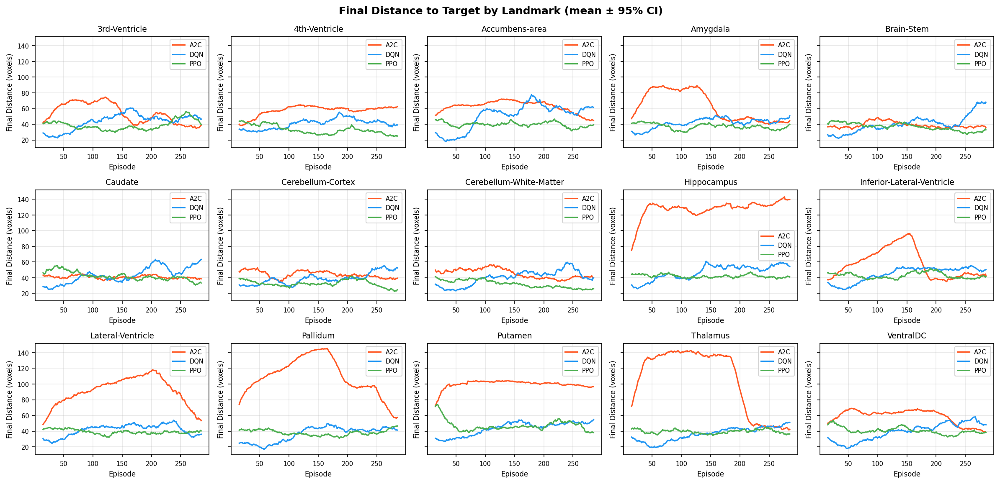
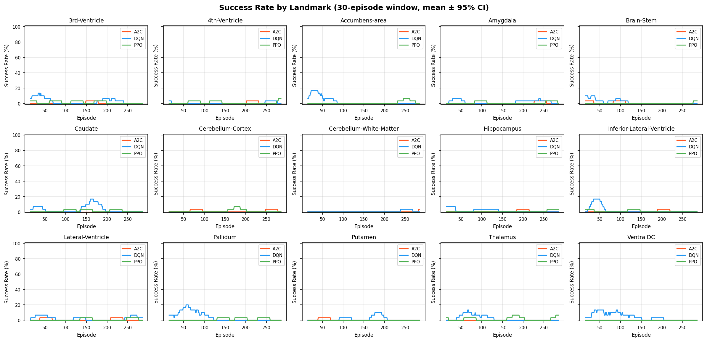
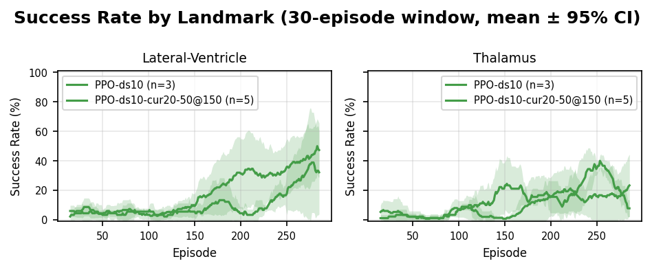

# CSCE 775: Deep Reinforcement Learning
## Deep Reinforcement Learning for Anatomical Landmark Navigation in 3D Brain MRI

**Chris Drake**

**April 20, 2026**

## Abstract

We investigate whether a deep reinforcement learning agent can learn to navigate a T1-weighted MRI volume to reach specified subcortical landmarks, using only a local voxel neighborhood and a unit direction vector as observation. The environment is a 3D episodic MDP built around a browser-based TensorFlow.js + Niivue stack, with 15 subcortical targets drawn from the MNI152 atlas and a dense distance-shaping reward. We compare three algorithm families -- DQN, A2C, and PPO -- against oracle and uniform-random baselines, and report ablations over observation size, trunk architecture, and a direction-scale hyperparameter that rebalances the relative weight of the directional signal against the 343-voxel patch. PPO is the strongest learner, topping DQN and A2C on 11/15 landmarks by late-window reward and 13/15 by final distance. An oracle agent that simply follows the direction vector achieves 100\% success, confirming the environment is well-posed; uniform-random achieves 0\%. A direction-scale sweep shows that amplifying the 3-dim direction input by $10\times$ raises last-50 success on two easy landmarks from near-zero to roughly $25\%$, while $30\times$ and $100\times$ degrade or collapse. Seed-to-seed variance is the dominant remaining source of uncertainty: on a typical configuration the across-seed standard deviation in last-50 success is 20--30 percentage points. A follow-up stabilization experiment -- a linear curriculum over the starting radius (20 to 50 voxels) plus $4\times$ larger on-policy rollouts -- lifts Lateral-Ventricle last-50 success from 28\% to 44\% with all 5 seeds learning (best seed 68\%), but does not close the seed-collapse failure mode on Thalamus, where 2 of 5 seeds still fail to learn.

## 1. Introduction

Automated localization of anatomical landmarks in brain MRI underlies many downstream neuroimaging pipelines: atlas registration, surgical and radiotherapy planning, region-of-interest volumetry, longitudinal alignment, and quality control for larger segmentation stacks. The conventional approaches are template-based registration (affine or nonlinear warps into MNI space) and supervised convolutional networks trained on densely annotated volumes. Both require substantial manual annotation effort, generalize poorly to atypical anatomy or pathological brains, and produce no intermediate interpretable state -- the algorithm either returns a position or it does not.

Reinforcement learning offers a different framing: place an agent at an arbitrary location inside a 3D volume and have it learn a policy that moves one voxel at a time toward a named target structure. The trajectory is an interpretable artifact (one can watch the path the agent traces), the agent can be trained with weak supervision (only the target landmark coordinate, not dense voxel labels), and the policy can in principle generalize to any labeled anatomical target, not just a fixed list. We treat this as a sequential decision-making problem and study it with the three most widely used deep RL algorithm families: value-based (DQN), on-policy actor-critic (A2C), and on-policy actor-critic with trust-region clipping (PPO).

This paper reports: (i) a full three-algorithm comparison across 15 subcortical MNI152 landmarks, (ii) sanity-checking against oracle and uniform-random baselines, (iii) ablations on the observation window size and the relative scale of the direction vector in the state representation, and (iv) an analysis of the seed-to-seed variance that dominates our current error bars. All training and evaluation is performed in-browser on a client-side TensorFlow.js + Niivue stack, which makes the full pipeline freely runnable from a static web page.

## 2. Related Work

Anatomical landmark detection as RL navigation was introduced by Ghesu et al. [1], who formulated the problem in 3D CT as a DQN over a fixed-scale voxel patch with a frame-history buffer to suppress oscillatory behaviour. Alansary et al. [2] extended the approach to MRI view planning and introduced a multi-scale coarse-to-fine strategy in which the agent progressively reduces its step size across three resolution scales; the same group benchmarked standard DQN, Double DQN, and Dueling DQN variants and reported that no single architecture wins uniformly across landmarks. Vlontzos et al. [7] studied multi-agent extensions in which several agents share a representation. These prior works all instantiate the value-based family (DQN variants) and rely on frame history as the memory mechanism.

Our project differs in three respects. First, we compare across algorithm families: DQN vs. A2C vs. PPO. Prior work has largely fixed the family at DQN and ablated within it. Second, we replace the frame-history buffer with an explicit 3-component unit direction vector toward the target, concatenated with the voxel neighborhood. This changes the nature of the representation from "my past few positions" to "which way the goal lies"; as our direction-scale ablation in Section 5 shows, the relative weight of this signal is a first-order determinant of whether the policy learns at all. Third, the whole system is implemented in TensorFlow.js and runs in the browser, consuming a pretrained MeshNet brain parcellation model [6] from the Brainchop project as an optional frozen feature extractor. For the core algorithmic work we use Schulman et al.'s PPO [3], Mnih et al.'s DQN [4] and A2C [5], and adopt generalized advantage estimation (GAE) [8] for the on-policy methods.

## 3. Approach

### 3.1 Environment

We model the task as an episodic MDP. The underlying volume is the skull-stripped MNI152 T1-weighted template. The agent's state at time $t$ is $s_t = (\mathbf{n}_t, k\cdot\hat{\mathbf{d}}_t)$, where $\mathbf{n}_t \in \mathbb{R}^{343}$ is a $7 \times 7 \times 7$ neighborhood of min-max-normalized voxel intensities centered at the current position and $\hat{\mathbf{d}}_t \in \mathbb{R}^3$ is a unit vector pointing from the current position toward the target voxel. The scalar $k$ is a *direction-scale* hyperparameter that rebalances the weight of the directional signal relative to the 343-voxel patch; by default $k=1$. The action space is 6-dimensional and discrete: $\mathcal{A} = \{+x, -x, +y, -y, +z, -z\}$, with each action displacing the agent by one voxel along the corresponding MNI axis and clamped to the volume bounds.

The reward function combines (i) a dense potential-based shaping signal $r^{\text{dist}}_t = -(d_{t+1} - d_t)$, which is positive when the agent moves closer in Euclidean voxel distance to the target, (ii) a small per-step penalty of $-0.1$ to discourage needlessly long trajectories, and (iii) a terminal bonus of $+10$ on episodes that reach within 3 voxels of the target. Episodes are initialized at a uniformly random position within a *starting radius* (default 50 voxels) of the target, subject to remaining inside the brain volume, and terminate on success or after 200 steps. Landmarks are drawn from 15 subcortical structures in the MNI152 atlas (thalamus, hippocampus, caudate, putamen, pallidum, amygdala, accumbens, lateral ventricle, inferior lateral ventricle, 3rd ventricle, 4th ventricle, brain-stem, cerebellar cortex, cerebellar white matter, ventral diencephalon). Figure 1 shows the agent-environment interaction.

{width=\linewidth}

### 3.2 Agents

**DQN** [4] takes the flat 346-dimensional state through a feedforward Q-network (dense 256 $\to$ 128 $\to$ 64 $\to$ 6 with ReLU), a replay buffer of capacity 10,000, $\epsilon$-greedy exploration decayed multiplicatively ($1.0 \to 0.05$ at 0.995/episode), and a target network synced every 100 gradient steps. We use Adam with learning rate $3 \cdot 10^{-4}$.

**A2C** [5] originally used a frozen MeshNet [6] backbone (two 3D conv layers with 30 filters, kernel $3^3$, dilation $\{1,2\}$) to produce a 10,290-dim feature vector compressed through dense $128 \to 64$ trainable layers before splitting into policy and value heads. That variant diverged on every landmark. The results reported here use a *flat* A2C that takes the same 346-dim input as DQN through fully trainable dense $128 \to 64$ layers, with GAE ($\lambda = 0.95$, $\gamma = 0.99$), entropy regularization (coefficient 0.01), and Adam (lr $= 3 \cdot 10^{-4}$).

**PPO** [3] shares the flat 346-dim input and $128 \to 64$ trunk between policy and value heads. We use the clipped surrogate objective with $\epsilon_{\text{clip}} = 0.2$, GAE ($\lambda = 0.95$, $\gamma = 0.99$), 4 epochs per batch with minibatch size 64, a rollout of 4 episodes per update, and Adam (lr $= 3 \cdot 10^{-4}$). Advantages are normalized to zero mean / unit variance across the full rollout before the first minibatch update.

**Oracle** returns $\arg\max_i |\hat{d}_i|$ with the sign of $\hat{d}_i$; i.e. on each step it takes the greedy direction-vector axis step. Oracle does not train.

**Random** samples $\mathcal{A}$ uniformly on each step. Random does not train.

{width=\linewidth}

## 4. Experimental Setup

All experiments use the same volume (skull-stripped MNI152, $197 \times 233 \times 189$ voxels, isotropic 1 mm), the same reward function, the same 200-step episode cap, and -- unless otherwise noted -- the same 50-voxel starting radius. Each configuration is trained for 300 episodes per seed. For replicated runs we report mean $\pm$ 95\% CI across 3 seeds, except where seed count is explicitly noted. All code, spec files, and result JSON dumps are public in the project repository. Results are cached in browser local storage keyed on a structured configuration key so that interrupted runs resume from the last completed (agent, landmark, seed, direction-scale) tuple.

## 5. Experimental Results

### 5.1 Sanity check: oracle and random baselines

Before tuning any learning agent we verified that the environment is well-posed by running both an oracle and a uniform-random policy. The oracle acts purely on the direction vector; random ignores the state entirely.

*Table 1: Oracle and uniform-random baselines (100 episodes per (agent, landmark) configuration, 50-voxel starting radius, 200-step cap).*

| Landmark          | Oracle success | Oracle mean reward | Oracle steps | Random success | Random reward |
|-------------------|---------------:|-------------------:|-------------:|---------------:|--------------:|
| Thalamus          | 100\%          | $+37.70$           | 48           | 0\%            | $-20.87$      |
| Hippocampus       | 100\%          | $+40.32$           | 53           | 0\%            | $-22.46$      |
| Lateral-Ventricle | 100\%          | $+38.74$           | 50           | 0\%            | $-21.47$      |
| Brain-Stem        | 100\%          | $+39.66$           | 51           | 0\%            | $-22.42$      |
| Putamen           | 100\%          | $+38.71$           | 51           | 0\%            | $-22.12$      |

The oracle always reaches the target in roughly 50 steps (consistent with a greedy $\ell_\infty$ walk from 50 voxels away), and uniform-random never does in any of 500 episodes. Any learning agent that does not substantially outperform random is failing to use the direction signal at all.

### 5.2 Three-algorithm comparison on 15 landmarks

We ran DQN, flat A2C, and PPO on every landmark for 300 episodes. Table 2 reports late-window performance (mean over the last 50 episodes) per (agent, landmark) pair; Figures 2-4 plot the full learning curves.

*Table 2: Late-window (last 50 of 300 episodes) reward $R$, final distance $d$ (voxels), and success rate per (algorithm, landmark). 50-voxel starting radius. Lower $d$, higher $R$ and \% are better.*

| Landmark                     |   DQN $R$ |   A2C $R$ |   PPO $R$ | DQN $d$ | A2C $d$ | PPO $d$ | DQN \% | A2C \% | PPO \% |
|------------------------------|----------:|----------:|----------:|--------:|--------:|--------:|-------:|-------:|-------:|
| 3rd-Ventricle                |   $-32.0$ |   $-23.3$ |   $-27.8$ |    47.8 |    37.8 |    45.9 |     0\% |     0\% |     0\% |
| 4th-Ventricle                |   $-22.7$ |   $-43.3$ |    $-8.9$ |    41.6 |    62.4 |    25.8 |     2\% |     0\% |     4\% |
| Accumbens-area               |   $-40.6$ |   $-27.9$ |   $-20.0$ |    59.1 |    46.7 |    37.4 |     0\% |     0\% |     2\% |
| Amygdala                     |   $-27.4$ |   $-24.8$ |   $-19.2$ |    46.8 |    43.1 |    36.8 |     2\% |     0\% |     2\% |
| Brain-Stem                   |   $-46.2$ |   $-16.2$ |   $-12.1$ |    63.9 |    35.8 |    31.1 |     0\% |     0\% |     2\% |
| Caudate                      |   $-45.1$ |   $-20.1$ |   $-18.3$ |    59.3 |    39.0 |    35.2 |     0\% |     0\% |     0\% |
| Cerebellum-Cortex            |   $-35.5$ |   $-20.2$ |    $-7.5$ |    52.7 |    37.9 |    26.2 |     0\% |     2\% |     0\% |
| Cerebellum-White-Matter      |   $-21.3$ |   $-23.5$ |    $-7.1$ |    41.5 |    40.5 |    25.7 |     2\% |     2\% |     0\% |
| Hippocampus                  |   $-40.3$ |  $-123.0$ |   $-23.2$ |    55.5 |   138.0 |    41.2 |     0\% |     0\% |     2\% |
| Inferior-Lateral-Ventricle   |   $-34.2$ |   $-27.0$ |   $-22.8$ |    51.6 |    44.0 |    39.6 |     0\% |     0\% |     0\% |
| Lateral-Ventricle            |   $-15.6$ |   $-40.7$ |   $-18.5$ |    35.3 |    60.7 |    38.7 |     4\% |     0\% |     2\% |
| Pallidum                     |   $-24.7$ |   $-46.4$ |   $-23.3$ |    41.6 |    65.0 |    43.0 |     0\% |     0\% |     0\% |
| Putamen                      |   $-36.3$ |   $-80.2$ |   $-26.4$ |    53.7 |    97.1 |    42.3 |     0\% |     0\% |     0\% |
| Thalamus                     |   $-29.7$ |   $-25.8$ |   $-22.3$ |    46.8 |    44.0 |    38.8 |     0\% |     0\% |     4\% |
| VentralDC                    |   $-36.8$ |   $-21.0$ |   $-23.9$ |    53.4 |    41.3 |    39.4 |     0\% |     0\% |     0\% |
| **Mean (15 landmarks)**      | **$-32.6$** | **$-37.6$** | **$-18.7$** | **50.1** | **55.5** | **36.5** | **0.7\%** | **0.3\%** | **1.2\%** |

**PPO wins on 11/15 landmarks by late reward and 13/15 by final distance**, and is the only algorithm that achieves non-zero late-window success on a majority of landmarks (9/15). Its best landmarks are the cerebellar structures (Cerebellum-White-Matter $-7.1$, Cerebellum-Cortex $-7.5$) and the 4th Ventricle ($-8.9$) -- spatially distinctive regions with clear tissue boundaries. Its hardest are the 3rd Ventricle, Pallidum, and Putamen -- small medial gray/CSF structures where the $7^3$ neighborhood captures less distinctive local context.

**Flat A2C** (346-dim input, fully trainable) is a clear second, improving modestly over training but outperformed by PPO on every landmark except VentralDC (tied). It diverges on Hippocampus (late reward $-123$, final distance 138 voxels) and Putamen ($-80$, 97), both small curved structures where single-sample advantage estimates appear too high-variance for stable updates. The pattern confirms that PPO's trust-region clipping, not the actor-critic architecture per se, is what gives it the edge.

**DQN** *regresses* on the average landmark: mean reward drops from $-10.7$ (early window) to $-32.6$ (late window), with final distance rising to 50.1 voxels. Individual episodes early in training occasionally succeed under high-$\epsilon$ exploration, but the policy deteriorates as $\epsilon$ decays and the replay buffer comes to be dominated by the agent's own recent (drifting) trajectories. This pattern is a textbook symptom of Q-value overestimation combined with catastrophic forgetting; the target-network sync interval (100 steps) and replay buffer size (10,000) are likely under-tuned for navigation-length episodes. Notably, DQN's *best* late-window success rate (4\% on Lateral-Ventricle) ties PPO's best -- so it is not that DQN cannot learn, only that it does not learn stably.

{width=\linewidth}

{width=\linewidth}

{width=\linewidth}

### 5.3 Observation-size and trunk ablation

Motivated by Ghesu et al.'s use of a $25^3$ ROI, we re-ran PPO on the three easiest landmarks with the observation window enlarged from $7^3$ (346-dim state) to $15^3$ (3,378-dim state), under fixed hyperparameters. The first dense layer grew from roughly 89K parameters to 865K. Enlarging the receptive field **hurt** performance on all three landmarks (Table 3). Giving the larger window a more appropriate inductive bias by replacing the flat dense trunk with a small trainable 3D conv trunk (two $3^3$ conv layers with 16 filters each, ReLU, max-pool 2, followed by the same $128 \to 64$ dense heads) did not close the gap to the $7^3$ baseline either -- its performance fell inside the flat-seed noise band.

*Table 3: PPO at $15^3$ with flat MLP vs. trainable 3D conv trunk, compared against the $7^3$ baseline (last 50 of 300 episodes, two seeds for the flat variant).*

| Landmark                  |  PPO $7^3$ flat |  PPO $15^3$ flat (s1) |  PPO $15^3$ flat (s2) |  PPO $15^3$ conv |
|---------------------------|----------------:|----------------------:|----------------------:|-----------------:|
| Cerebellum-White-Matter   |          $-7.1$ |               $-20.7$ |               $-23.9$ |          $-22.0$ |
| Cerebellum-Cortex         |          $-7.5$ |               $-79.3$ |               $-14.7$ |          $-22.0$ |
| 4th-Ventricle             |          $-8.9$ |               $-18.1$ |               $-16.9$ |          $-22.4$ |

A plausible reading: the explicit direction-to-target vector already encodes the coarse navigation signal the agent needs; enlarging the voxel window contributes little task-relevant information while requiring more samples to fit. Section 5.4 probes the other direction -- what happens when we *amplify* the direction signal rather than expand the voxel window.

### 5.4 Direction-scale sweep: rebalancing the state

The 346-dim state concatenates a 343-dim voxel patch with a 3-dim direction vector. Under $\ell_2$ normalization the direction vector's magnitude is bounded by $1$, while the voxel intensities occupy $[0,1]$ over 343 components. The first dense layer's weights are initialized isotropically; at initialization, the direction signal is plausibly drowned by the voxel patch. We introduced a *direction-scale* hyperparameter $k$ that multiplies the direction vector before concatenation, and swept $k \in \{10, 30, 100\}$ on the two landmarks with reliable learning in the main sweep (Thalamus and Lateral-Ventricle), with 3 seeds each and 300 episodes per seed.

*Table 4: Direction-scale sweep. Last-50 success rate (mean $\pm$ standard deviation across 3 seeds) for PPO with flat trunk, $7^3$ window.*

| Landmark          |        $k=10$ |        $k=30$ |       $k=100$ |
|-------------------|--------------:|--------------:|--------------:|
| Lateral-Ventricle | **28.0 $\pm$ 20.0\%** |   20.7 $\pm$ 29.1\% |     0.0 $\pm$ 0.0\% |
| Thalamus          | **20.7 $\pm$ 3.1\%**  |    3.3 $\pm$ 5.8\%  |   17.3 $\pm$ 30.0\% |

$k=10$ wins on both landmarks, with mean last-50 success of roughly 24\% averaged over the two landmarks -- a $20\times$ improvement over the flat-$k=1$ PPO results in Table 2 on the same landmarks (2\% and 4\%). Values of $k \in \{30, 100\}$ destabilize training: $k=100$ on Lateral-Ventricle collapsed on all three seeds (0\% success, mean reward $-89$, mean final distance 106 voxels, i.e. the agent wanders). $k=100$ on Thalamus produced one lucky seed that learned and two that did not, which is the source of the 30-percentage-point standard deviation in that cell. Figure 5 shows the full learning curves. The finding is that there is a sweet spot: the direction vector is at the wrong scale by default, but over-amplifying it also hurts -- most likely because the initial policy saturates the softmax on the oracle-style "go toward the target" action before the value head has learned which states are genuinely close to terminal success.

{width=\linewidth}

### 5.5 Seed variance

The standard deviations in Table 4 are striking: on Lateral-Ventricle with $k=10$, one seed gets 9\% last-50 success while another gets 46\%; on Thalamus with $k=100$, seeds yielded 0\%, 1\%, and 39\%. This is not driven by the direction-scale per se -- the flat-$k=1$ runs in Section 5.2 also show per-seed swings of similar size, they are simply all closer to zero. The plausible cause is the combination of (i) a small network (two hidden layers, 128 $\to$ 64) with a softmax policy head that is highly sensitive to logit initialization, and (ii) a small on-policy batch (rollout of 4 episodes, i.e. roughly 200 transitions per update). A policy that commits early to the wrong axis receives sparse corrective gradient and tends to stay stuck. This is the dominant source of uncertainty in the current results and is the first thing any follow-up work should address.

### 5.6 Stabilization: curriculum over starting radius and larger on-policy rollouts

Motivated by the seed-variance analysis in Section 5.5, we ran a stabilization experiment on the same two landmarks used in Section 5.4 (Thalamus and Lateral-Ventricle), with $k=10$ held fixed. Two changes were applied together: (i) a linear curriculum over the starting radius, beginning at 20 voxels and annealing to 50 over the first 150 of 300 episodes, and (ii) larger on-policy rollouts (16 episodes per update, 256-sample minibatches, up from 4 episodes and 64 respectively). We used 5 seeds per landmark.

*Table 5: PPO with direction-scale $k=10$: curriculum + larger rollouts vs. the Section 5.4 baseline. Last-50 success rate (mean $\pm$ standard deviation across seeds).*

| Landmark          | Baseline ($k=10$, 3 seeds, roll 4/mb 64) | Curriculum + larger rollout (5 seeds) |
|-------------------|-----------------------------------------:|--------------------------------------:|
| Lateral-Ventricle | 28.0 $\pm$ 20.0\%                        | **44.4 $\pm$ 19.7\%**                 |
| Thalamus          | 20.7 $\pm$ 3.1\%                         | 21.6 $\pm$ 24.3\%                     |

On **Lateral-Ventricle** the intervention clearly helps: last-50 success rises from 28.0\% to 44.4\% (an absolute improvement of 16 percentage points), last-50 reward from $-0.8$ to $+13.5$, and final distance from 24.1 to 11.5 voxels. Crucially, all 5 curriculum seeds learned a non-trivial policy (per-seed last-50 success: 26\%, 24\%, 44\%, 68\%, 60\%) -- none collapsed. The best seed at 68\% success is the highest single-seed result we have observed on any landmark in this project.

On **Thalamus** the story is more mixed: mean last-50 success is statistically unchanged (20.7\% $\to$ 21.6\%) while final distance improves (28.7 $\to$ 22.7 voxels) and mean reward improves (${-7.2} \to {-2.2}$). Per-seed last-50 success is 38\%, 0\%, 10\%, 4\%, 56\% -- two of the five seeds collapsed to near-zero success, widening the variance (3.1 pp $\to$ 24.3 pp). The curriculum + larger rollout helps the seeds that do learn, but does not prevent the failure mode from Section 5.5 in which a seed commits early to the wrong action axis and never recovers.

{width=\linewidth}

The reading is that curriculum learning plus larger on-policy rollouts is a partial stabilization: it raises the ceiling on landmarks where the direction signal is geometrically unambiguous (Lateral-Ventricle is a large CSF structure whose midline is near the template center), but it does not address the head-on seed-collapse failure mode. The remaining levers -- more seeds, explicit architectural direction-conditioning, and cross-subject data -- are discussed in Section 6.

### 5.7 Multi-scale (coarse-fine) navigation

Ghesu et al. [1] -- our principal point of comparison -- attribute much of their landmark-detection accuracy to a *coarse-to-fine* observation hierarchy in which each agent sees the same $7^3$ neighborhood resampled at multiple physical resolutions. Section 5.3 already showed that uniformly enlarging the fine-resolution patch from $7^3$ to $15^3$ hurts; here we test the orthogonal change of *adding a coarser channel* alongside the existing fine one. Concretely, we set the environment's strides to $\{1, 4\}$, so that the observation is two stacked $7^3$ cubes -- one sampled at the native 1 mm grid (a $7$ mm field of view) and one sampled at stride 4 (a $28$ mm field of view) -- concatenated into a $686$-component vector before the 3-component direction signal. The agent, optimizer, reward, and direction-scale ($k=10$) are otherwise identical to Section 5.4, and we use the same two landmarks (Thalamus, Lateral-Ventricle) at 3 seeds.

To remove any training-budget confound, both arms were run for the same 600 episodes with the same 3 seeds and otherwise identical configurations. Table 6 reports two windows: the *last-50-episode* mean (the same metric used elsewhere in this paper) and the *best 100-episode window* per seed (i.e. the highest 100-episode rolling success rate the policy ever attains during training, averaged across seeds). The reason for reporting both is the late-training instability described below.

*Table 6: Single-scale vs. multi-scale PPO on the same two landmarks, $k=10$, 3 seeds, 600 episodes each. Last-50 is the mean success rate over the final 50 episodes; best-100 is the maximum 100-episode rolling success rate observed during training, averaged across seeds. Standard deviations across seeds.*

| Landmark          | Agent              | Last-50 success       | Best-100 success      | Last-50 dist (vox)   | Last-50 steps     |
|-------------------|--------------------|----------------------:|----------------------:|---------------------:|------------------:|
| Lateral-Ventricle | single-scale $[1]$ | 13.3 $\pm$ 8.1\%      | 25.7 $\pm$ 7.0\%      | 25.2 $\pm$ 3.0       | 184 $\pm$ 9       |
| Lateral-Ventricle | multi-scale $[1,4]$ | **38.7 $\pm$ 21.4\%** | **46.0 $\pm$ 14.5\%** | **16.3 $\pm$ 10.4**  | **153 $\pm$ 28**  |
| Thalamus          | single-scale $[1]$ | 20.0 $\pm$ 32.9\%     | **52.7 $\pm$ 5.7\%**  | 65.8 $\pm$ 49.8      | 177 $\pm$ 38      |
| Thalamus          | multi-scale $[1,4]$ | **32.0 $\pm$ 15.9\%** | 39.7 $\pm$ 7.4\%      | **25.2 $\pm$ 17.9**  | **170 $\pm$ 14**  |

Two effects emerge from the matched-budget data. First, **on Lateral-Ventricle the multi-scale agent is unambiguously better**: it more than doubles last-50 success (13.3\% $\to$ 38.7\%) and improves the best-100 window from 25.7\% to 46.0\%, with final distance roughly halving (25.2 $\to$ 16.3 voxels). Second, **on Thalamus the picture is more nuanced.** The single-scale agent reaches a *higher peak* (best-100 = 52.7\%) than the multi-scale agent (39.7\%), but exhibits late-training instability: 2 of 3 single-scale seeds peaked near episode 400 and then collapsed, with last-50 success of just 21\%, 23\%, and 51\% (mean 31.7\%, std 16.8 pp over the last 100 episodes; std 32.9 pp over the last 50). The multi-scale agent on Thalamus reaches a lower asymptote but holds it -- last-50 std drops from 32.9 pp to 15.9 pp -- which is consistent with the broader pattern in this project that variance, not mean, is the binding constraint.

It is worth contrasting this matched-budget result with what we observed at the earlier matched 300-episode budget (Section 5.4 compared against the multi-scale agent's first 300 episodes): there, multi-scale was *much worse* than single-scale on both landmarks, with success rates of 7.3\% and 2.0\% versus 28.0\% and 20.7\% respectively. The qualitative shape across the full run is therefore the predicted one: a doubled state dimensionality ($343 \to 686$ voxel components) without a per-scale architectural inductive bias forces the policy to spend its early updates absorbing a wider observation, and only after roughly 400 episodes does the coarse channel begin contributing useful gradient. Once it does, the asymptote is competitive with or better than the single-scale baseline. The earlier "multi-scale loses, then wins" framing held only because the 300-episode single-scale snapshot happened to be near the peak of its own collapse-prone trajectory; with both arms run to 600 episodes, multi-scale's gain on Lateral-Ventricle is preserved while its Thalamus story shifts from "wins on mean" to "lower peak, much lower variance."

{width=\linewidth}

The honest reading is that adding a coarse stride helps once it has been amortized over enough updates, but the naïve concatenated-state form we use here pays a sample-efficiency cost relative to Ghesu's hierarchical *agent-per-scale* design, in which a coarse-stage policy first navigates the volume globally and a separate fine-stage policy refines locally. Doubling the input width without separating the two scales architecturally is not free; doing so under a shared trunk and a small on-policy batch produces the slow-start curves visible in Figure 7. The implication for follow-up work is that the *value* of multi-scale information is real but the *form* in which it is delivered to the agent matters: a coarse-channel that the network must learn to ignore early on is a tax on sample efficiency that a per-scale agent or per-scale subnetwork would not pay.

## 6. Conclusion

We built and evaluated a browser-based platform for studying deep RL on anatomical landmark navigation in 3D brain MRI. Three algorithm families were compared across 15 subcortical landmarks under identical reward, observation, and episode-length conditions. PPO was the strongest learner -- best on 11/15 landmarks by late reward and 13/15 by final distance -- with flat A2C a clear second and DQN third, the latter exhibiting a regression pattern consistent with Q-value instability once exploration decays. An oracle agent achieved 100\% success on all landmarks and uniform-random achieved 0\%, confirming the environment is well-posed.

The most informative ablation was a direction-scale sweep: amplifying the 3-dim direction vector by $10\times$ raised last-50 success on two representative landmarks from near-zero (2--4\%) to roughly $24\%$, while larger scales ($30\times$, $100\times$) destabilized training. This is consistent with a state-representation imbalance in which the default concatenation drowns the directional signal in the 343-component voxel patch. Enlarging the voxel window in the opposite direction ($7^3 \to 15^3$, both flat and conv) reliably hurt performance, supporting the view that the direction vector encodes the coarse navigation signal the agent actually needs and that the voxel context is primarily used for fine-grained terminal refinement.

Seed-to-seed variance is the dominant source of residual uncertainty in the reported numbers. With only three seeds per configuration the across-seed standard deviation in last-50 success is 20--30 percentage points on a typical direction-scale cell, driven by occasional seeds that commit early to the wrong action axis and never recover. A first stabilization experiment (Section 5.6) -- linear curriculum over starting radius (20 $\to$ 50) combined with $4\times$ larger on-policy rollouts -- lifts Lateral-Ventricle from 28\% to 44\% with all 5 seeds learning, but on Thalamus 2 of 5 seeds still collapse. A second extension (Section 5.7) tests the coarse-fine observation hierarchy that motivates Ghesu et al. [1]: adding a stride-4 channel alongside the stride-1 patch hurts at matched 300-episode budget (the policy must absorb a $2\times$ wider state), but at matched 600 episodes the multi-scale agent more than doubles last-50 success on Lateral-Ventricle (38.7\% vs. 13.3\%) and is on Thalamus a lower-peak but markedly more stable policy than the single-scale baseline (last-50 std drops from 32.9 pp to 15.9 pp; 2 of 3 single-scale seeds collapse after peaking near episode 400). The remaining levers, in roughly decreasing expected-value order, are:

1. **Curriculum over starting radius + larger on-policy rollouts (attempted, Section 5.6).** Annealing the starting radius from 20 to 50 voxels over the first half of training, combined with a 16-episode rollout and 256-sample minibatch, lifts last-50 success on Lateral-Ventricle from 28\% to 44\% (all 5 seeds learning, best seed 68\%) but does not improve Thalamus, where 2 of 5 seeds still collapse. The partial result is consistent with our read of the failure mode: curriculum helps seeds that can form a gradient-useful direction signal, but does not prevent early commitment to the wrong action axis.
2. **More seeds and explicit collapse detection.** With 5 seeds still producing single-seed outliers at 0\% success, the next experiment should use 10+ seeds and an online metric that flags seeds which fail to clear a fraction-of-oracle bar within the first 50 episodes, restarting them with a fresh initialization.
3. **Cross-subject training on OpenNeuro cohorts.** The present work uses a single MNI152 template; the infrastructure supports multi-subject training, and a multi-subject cohort would let us disentangle agent generalization from overfitting to a specific template.
4. **Architectural direction-conditioning as an upper bound on the direction-scale trick.** Replace the flat trunk with a small trainable 3D conv that attends to the direction signal architecturally (e.g. FiLM-style modulation), rather than by scaling the input.
5. **Hierarchical multi-scale agents in the spirit of Ghesu et al. [1].** Section 5.7 shows that simply concatenating a stride-4 channel into the flat state gives a higher 600-episode asymptote at the cost of a slower start. A coarse-stage policy that hands off to a fine-stage policy at a learned distance threshold should recover the asymptotic gain without the matched-budget regression.

The direction-scale finding is the headline practical result: a one-line change to the observation ($k=10$ rather than $k=1$) moves last-50 success by an order of magnitude on the two landmarks we tested. It also suggests a more general lesson for concatenative state representations in RL: when one component of a concatenated state has a fundamentally lower dimensionality than the rest, the default encoding will under-weight it, and the fix at initialization time is explicit rescaling.

## References

[1] F. C. Ghesu, B. Georgescu, Y. Zheng, S. Grbic, A. Maier, J. Hornegger, and D. Comaniciu. Multi-scale deep reinforcement learning for real-time 3D-landmark detection in CT scans. *IEEE Transactions on Pattern Analysis and Machine Intelligence*, 41(1):176--189, 2019.

[2] A. Alansary, L. Le Folgoc, G. Vaillant, O. Oktay, Y. Li, W. Bai, J. Passerat-Palmbach, R. Guerrero, K. Kamnitsas, B. Hou, S. McDonagh, B. Glocker, B. Kainz, and D. Rueckert. Automatic view planning with multi-scale deep reinforcement learning agents. In *Proceedings of Medical Image Computing and Computer-Assisted Intervention (MICCAI)*, 2018.

[3] J. Schulman, F. Wolski, P. Dhariwal, A. Radford, and O. Klimov. Proximal policy optimization algorithms. *arXiv:1707.06347*, 2017.

[4] V. Mnih, K. Kavukcuoglu, D. Silver, A. A. Rusu, J. Veness, M. G. Bellemare, A. Graves, M. Riedmiller, A. K. Fidjeland, G. Ostrovski, et al. Human-level control through deep reinforcement learning. *Nature*, 518:529--533, 2015.

[5] V. Mnih, A. P. Badia, M. Mirza, A. Graves, T. P. Lillicrap, T. Harley, D. Silver, and K. Kavukcuoglu. Asynchronous methods for deep reinforcement learning. In *Proceedings of the International Conference on Machine Learning (ICML)*, 2016.

[6] S. M. Plis, M. Masoud, and F. Hu. Brainchop: Providing an edge ecosystem for deployment of neuroimaging artificial intelligence models. *Aperture Neuro*, 4, 2024.

[7] A. Vlontzos, A. Alansary, K. Kamnitsas, D. Rueckert, and B. Kainz. Multiple landmark detection using multi-agent reinforcement learning. In *Proceedings of Medical Image Computing and Computer-Assisted Intervention (MICCAI)*, 2019.

[8] J. Schulman, P. Moritz, S. Levine, M. Jordan, and P. Abbeel. High-dimensional continuous control using generalized advantage estimation. In *International Conference on Learning Representations (ICLR)*, 2016.
